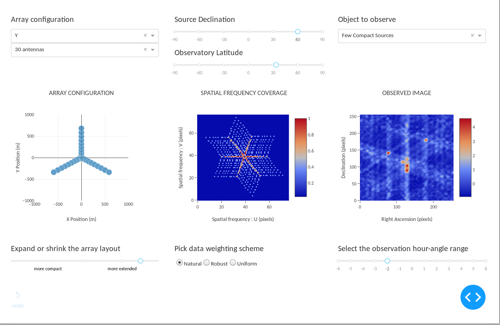
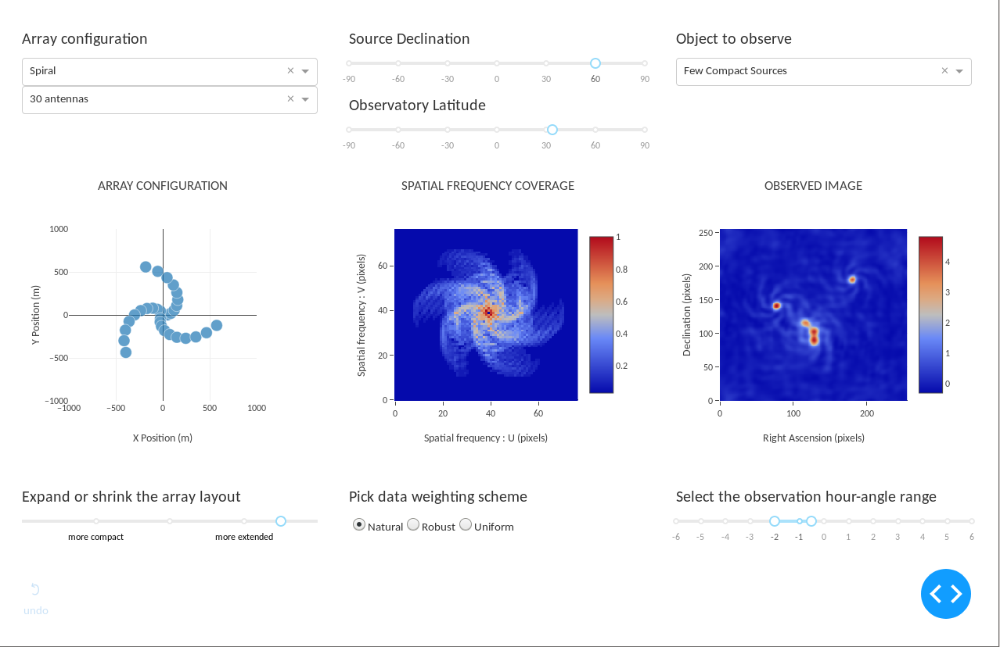

# ImagingSimulator
An interactive tool to introduce the concepts of how an imaging radio interferometer works

Supported Features :

- Select array configurations and observation setup options
- Select of types of sources to observe
- Choose the time duration of the observation and a data weighting scheme
- Display antenna array configuration, spatial frequency coverage and the observed image. 

Run the simulator :

- Install  'pandas' and  'dash' 
- Run the app as   <path-to-python>/ipython simmer.py
- You should see : 
           Running on http://127.0.0.1:8050
           Debugger PIN: 650-504-788
  
- Point your browser to  http://127.0.0.1:8050/

Example Screenshots : 

